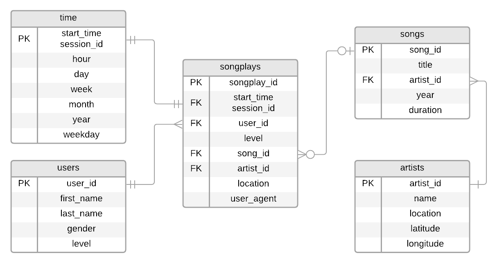

# Sparkify Songplays Database

This is an educational data engineering project to learn about data modeling in PostgreSQL.

**Note**: Sparkify is a fictitious music streaming company.

## Motivation

In order to understand what our users are listening to, we have created the Sparkify database, which will allow us to better analyze our customers' activity. With this database, we will be able to answer questions such as:

- What are the most popular songs?
- What are the most popular artists overall?
- What are the most popular artists at a given time of the day?
- What artists and songs do specific users prefer?
- At what time does our service have the most and the least active users?

## Databse Design

This database fllows a star schema, with a central "Facts" table and several "Dimension" tables that extend the central table information. Since the information we're most interested about regards the songs played by our users, the "Facts" table is the one that registers the instances of users playing specific songs. The "Dimension" tables that extend the information condensed in the central table are those bearing records about the users, the songs, the artists, and the moment in time at which the song were played.

The database entity-relationship diagram is:



## Reposiroty Files

This repository is comprised of the following files:

- `create_tables.py`: script that drops the database and its tables if they already exist and creates a new empty database with its tables according to the creation schema in `sql_queries.py`.
- `etl.ipynb`: notebook used to test the ETL pipline by inserting some (not all) rows.
- `etl.py`: script that executes the ETL procedure and populates the database with all the data.
- `sql_queries.py`: module that contains all the queries used to drop, create, and insert records into the database.
- `test.ipynb`: notebook used to verify that the database has been correctly populated.

## ETL Pipeline

The ETL pipeline can be split into two separate procedures:

### Processing song data

These data reside in `./data/song_data` and comprises multiple JSON files that must be parsed via [pandas](https://pandas.pydata.org) before being inserted into the database through the insertion queries contained in `sql_queries.py` to populate the `songs` and `artists` tables.

### Processing log data

These data reside in `./data/log_data` and comprises multiple JSON files that must be parsed via [pandas](https://pandas.pydata.org) before being inserted into the database through the insertion queries contained in `sql_queries.py` to populate the `songplays`, `users`, and `time` tables.

The `songplays` table is a special case since its `song_id` and `artist_id` fields must be found in the `songs` and `artists` tables via the `song_select` query in `sql_queries.py` before they can be inserted.

## How to Create the Database

To create the database, follow these steps:

1. <a name=step1></a>Run the `create_tables.py` Python script.
2. Run the `etl.py` Python script.
3. Run the cells in the `test.ipynb` IPython notebook to verify the database has been populated.

**Note:** [Step 1](#step1) can be omitted in this particular implementation since the `etl.py` script has been modified to automatically run `create_tables.py`.

## Query Example

Thanks to this database, we could, for instance, answer the question: how many songs, in average, are listened to per session?

To do so, we can run the following query:

```sql
SELECT AVG(countBySession.count) FROM
    (SELECT session_id, COUNT(songplay_id) FROM songplays
    GROUP BY session_id) AS countBySession;
```

After getting the results of this query, we could confirm that the average number of songs played per session is about nine.